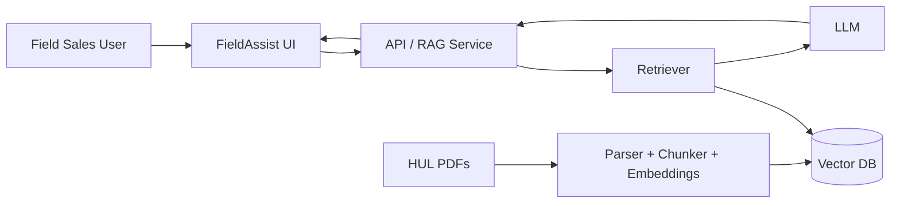

# HUL FieldAssist

**AI Sales Copilot for the Frontline**

> Ask anything. Sell smarter. Verify every answer.

A production-minded RAG prototype for a field-sales team using public Hindustan Unilever Limited (HUL) documents as stand-ins for internal catalogues, scheme circulars and pricing policies.

## Why this product

A field salesperson often needs an answer in seconds while standing with a retailer. The product is therefore designed around the **moment of decision**, not around a generic document chatbot.

FieldAssist supports:
- natural-language document Q&A
- page-level source citations
- newest-source preference through metadata
- evidence-aware refusal when information is absent
- retailer-friendly explanations
- product/category discovery

**Important:** this prototype uses public HUL material. It does not contain confidential HUL pricing, distributor margins or internal schemes. Any synthetic demo documents must be clearly labelled as synthetic.

## Architecture



See `diagrams/network.mmd` and `diagrams/data_flow.mmd` for the full trust-boundary designs.

## Source corpus

The repository contains a manifest of **12 official HUL PDFs** spanning FY2021-22 through FY2025-26: annual reports, BRSRs, investor presentations and financial results. PDFs are downloaded at setup from official HUL domains instead of being committed to Git.

See `data/sources.yaml`.

## Local setup

```bash
git clone <your-repo-url>
cd hul-fieldassist
python -m venv .venv
source .venv/bin/activate  # Windows: .venv\\Scripts\\activate
pip install -r requirements.txt
cp .env.example .env
# add OPENAI_API_KEY
python ingestion/ingest.py
streamlit run app/main.py
```

Then open the Streamlit URL shown in the terminal.

### Run evaluation

```bash
python evaluation/run_eval.py
```

Results are written to `evaluation/results.json`. Do not fabricate accuracy numbers: review each answer and score groundedness, citation correctness and refusal behavior before reporting results.

## Retrieval design

### Chunking
- page-aware extraction with PyMuPDF/PyPDF-compatible parser
- ~260 words per chunk
- ~50-word overlap
- source/year/type/page metadata attached to every chunk

### Embeddings
`text-embedding-3-small` by default. The embedding model is configurable through `.env`.

### Vector store
Chroma with cosine distance for a zero-infrastructure local prototype. A production deployment can swap this for managed Qdrant/pgvector without changing the RAG contract.

### Retrieval
Top-K semantic retrieval, followed by optional reranking/recency weighting. Newer documents should win when answering time-sensitive questions such as “latest turnover”.

### Generation
Low-temperature LLM generation with a strict evidence-only system prompt. Material claims must carry `[S#]` source identifiers, which the UI maps back to the original document and page.

## Guardrails

The assistant is explicitly instructed not to invent:
- distributor margins
- discounts
- schemes
- commercial policy terms
- product claims
- availability

If evidence is insufficient, it must say it cannot verify the answer from the available documents.

## Evaluation plan

The 10-question set intentionally mixes:
1. basic retrieval
2. category/brand retrieval
3. product-specific retrieval
4. temporal/latest information
5. multi-document reasoning
6. an unanswerable commercial-policy question

Report three metrics after manual review:
- **Answer correctness**
- **Citation correctness**
- **Abstention quality**

## Production roadmap

1. Enterprise SSO + RBAC
2. Territory/distributor/retailer context
3. Authenticated internal scheme and price feeds
4. Hybrid lexical + semantic retrieval
5. Reranking model
6. Hindi/Hinglish and voice input
7. Feedback-driven evaluation
8. OpenTelemetry tracing, latency and cost monitoring
9. PII/DLP controls
10. Automated document versioning and expiry

## AI tools used

- ChatGPT — product framing, architecture, prompt/guardrail design, documentation
- Cursor — implementation/refactoring (if used during final build)
- OpenAI API — embeddings + answer generation

**Time target:** ~4 hours for the take-home prototype; productionization is explicitly out of scope.

## Demo storyline

1. Ask: “Which Home Care brands target value-seeking consumers?”
2. Ask: “What is Surf Excel Smart Shots?”
3. Ask: “Explain that to a retailer in simple language.”
4. Ask: “What is the current distributor margin for Surf Excel?”
5. Show the system refusing to invent unavailable commercial information.
6. Open the source citation and show page-level evidence.
7. Finish with the architecture and production roadmap.
